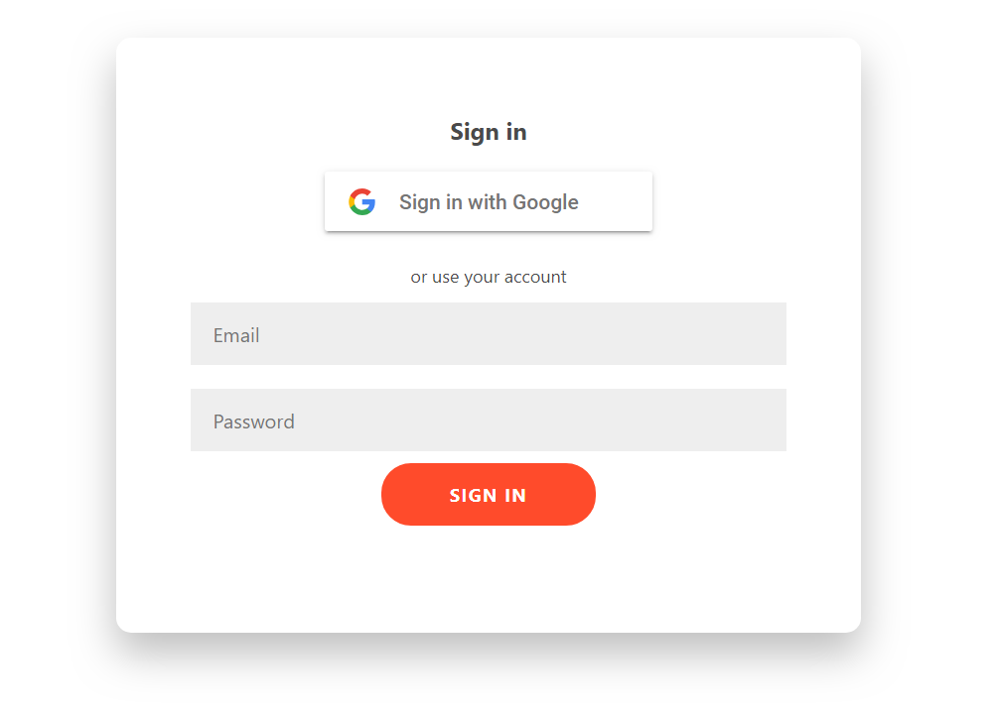

# MyTodoApp
* CRUD가 가능한 TodoApp입니다.
* React와 firebase의 firestore를 활용했습니다.
* firebase Authentication 을 통해 관리자가 지정한 email 또는 구글계정으로 로그인이 가능합니다.
* fireStore의 collection 구조는 계정별 UID로 관리되어 로그인한 계정의 DATA만 CRUD 권한이 주어집니다.
* CSS 프레임워크는 Bulma를 활용했습니다.
* Test Add: https://todo-6f8c3.firebaseapp.com/
    

# Screenshot

■ Login page

    

    

■ Main page

    

    
